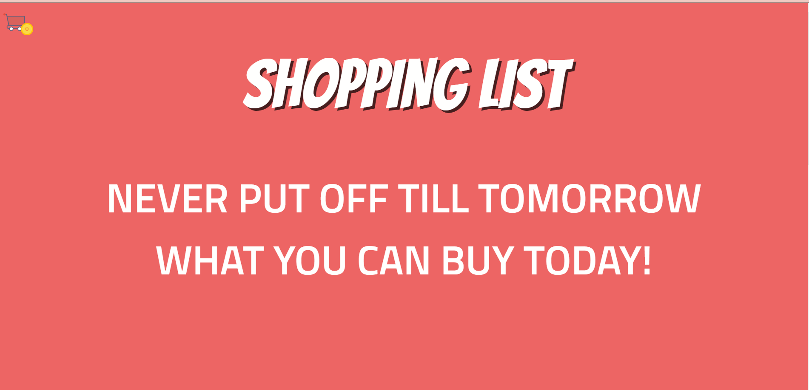
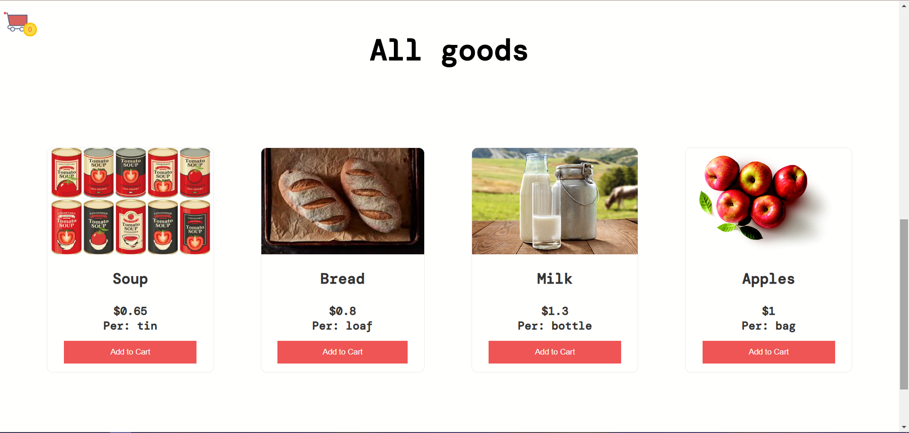
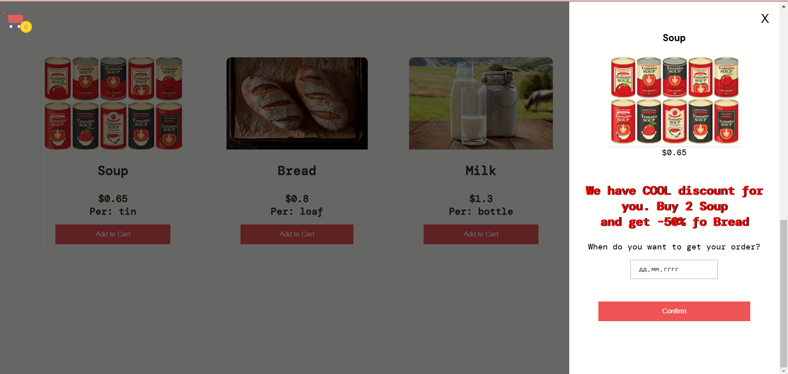
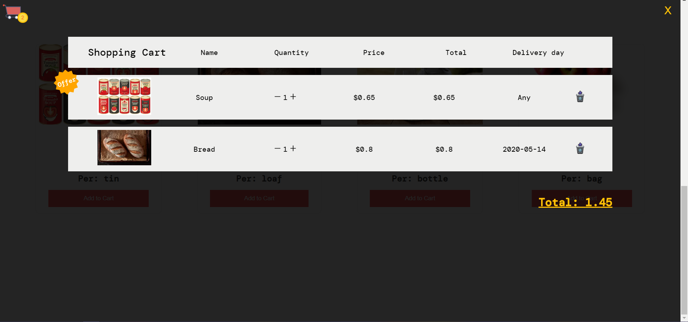

This project was bootstrapped with Create React App.

Available Scripts
In the project directory, you can run:

`yarn`

Installs packages and dependencies.

`yarn global add json-server`

Installs backend mock API server. 

`yarn api`

Runs the backend mock server.

`yarn start`

Runs the app in the development mode.
Open http://localhost:3000 to view it in the browser.

## Learn More

### Main

### Goods

### Modal

### Basket

